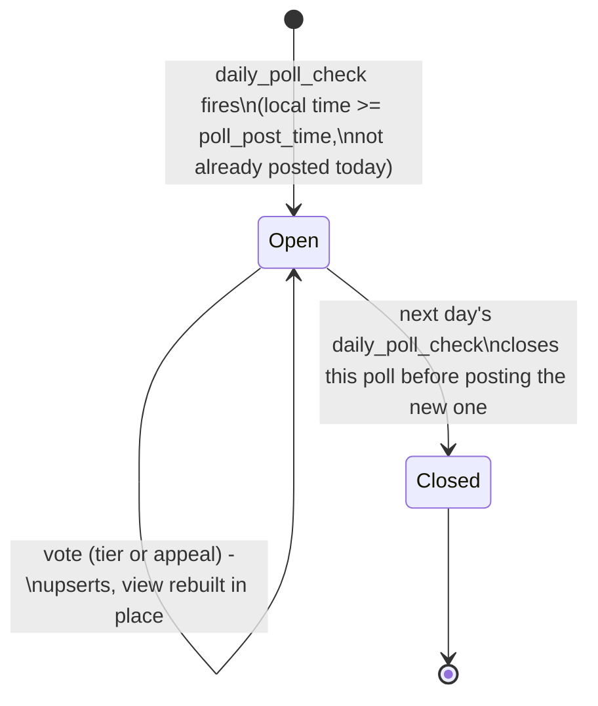

# oshinokobot — Architecture

## What this is

A Discord bot for a single guild whose main job is a daily character poll:
every day it posts a character (name + image), and members vote on two
independent questions — which archetype/audience tag the character would
most appeal to, and an S/A/B/C/D tier rating. An admin website manages the
character pool, tags, posting schedule, and results. It's designed as a
loose collection of misc/fun bot functionality; the poll is the first (and
currently only) feature, built inside a cog structure that leaves room for
more.

Full requirements/decisions live in [`PLAN.md`](PLAN.md); this file is the
as-built record of how those decisions turned into code, plus the reasoning
behind anything not obvious from reading the source.

## Single combined process

[watcher.staery.com/spec](https://watcher.staery.com/spec) is one `run.sh`,
one `$PORT`, one process per app. Rather than run the bot and the admin site
as two separate watcher deployments, this is **one process**:

- FastAPI/uvicorn is the thing bound to `127.0.0.1:$PORT` — it owns the
  admin UI and the health check.
- `discord.py`'s gateway client (`OshinokoBot`) runs alongside it as a
  background `asyncio.create_task`, started from FastAPI's `lifespan` and
  sharing the same `aiosqlite` connection and event loop.

`DISCORD_BOT_TOKEN` is optional at the config level — the admin site is
useful on its own (managing characters/tags ahead of time, reviewing past
poll results), so it shouldn't be impossible to start without one. When
it's unset, `lifespan` skips creating `OshinokoBot` entirely and logs that
it's running admin-only; nothing else changes.

The tradeoff, made deliberately: `/healthz` only reflects "is the HTTP
server up," not "is Discord connected." If the bot fails to log in (bad
token, revoked app, etc.), that's logged loudly to stdout — which watcher
captures — but the admin UI keeps running, since fixing a bad token needs a
host-level `.env` edit and restart regardless of whether the health check
is red or green. This is different from scheduler-bot's coupling (there,
the health server only starts after a successful gateway connection,
because `discord.py` doesn't itself listen on any port); with FastAPI as
the primary process here, decoupling the two seemed better than blocking
the whole admin site on Discord connectivity for a bot whose main value —
letting an admin manage characters — doesn't depend on Discord being up at
that moment.

## Poll lifecycle



- **Trigger**: a `discord.ext.tasks` loop ticks every minute
  (`app/bot/cogs/polls.py::daily_poll_check`). It compares the current local
  time (in the admin-configured `poll_timezone`) against `poll_post_time`,
  and compares the *date* of the most recently posted poll (also converted
  to that timezone) against today. Idempotency comes from that DB
  comparison, not an in-memory flag — a restart landing inside the same
  eligible minute won't double-post, unlike a naive "have I already checked
  this minute" flag would need to survive a restart to keep working.
- **Character selection**: uniformly random from characters with no row in
  `polls` yet (`db.pick_random_unused_character`). Once a character is
  posted, it's permanently "used," even if the poll technically failed
  (e.g. wrong channel) — there's no re-queue mechanism in v1 (see Open
  items).
- **Closing**: happens as the *first step* of advancing to the next poll,
  not on a separate 24-hour timer. The previous message gets edited in
  place — final tallies added as embed fields, the view rebuilt with every
  component disabled — rather than deleted or replaced.
- **Voting**: both questions are independent selections on the same
  message (`app/bot/views.py::PollView`) — a `discord.ui.Select` for the
  appeal tag, five `discord.ui.Button`s for the tier. Each vote is an
  upsert (`PRIMARY KEY (poll_id, user_id)` on both vote tables) — re-voting
  changes your answer, it doesn't stack. Every click rebuilds and
  re-renders the whole view via `edit_message`, so button/select labels
  carry live counts — the visible state change *is* the confirmation, no
  separate ephemeral "you voted for X" reply (same reasoning scheduler-bot
  used for its day/hour buttons).
- **Restart safety**: `Polls.cog_load` re-registers a `PollView` for
  whatever poll is currently `open`, with current counts, so a bot restart
  mid-poll doesn't orphan the buttons on the still-live message.

## Data model

```
schema_migrations   name, applied_at

users                                  -- admin accounts, CLI-created only
  id, username (unique), password_hash, created_at

characters
  id, name, series (nullable), image_path, source_url (nullable),
  uploaded_by -> users.id (nullable), created_at

archetype_tags
  id, name (unique), created_at

guild_config                            -- singleton row (id = 1)
  channel_id (nullable until set), poll_post_time, poll_timezone

polls
  id, character_id -> characters.id, channel_id, message_id (nullable
  until sent), status (open|closed), posted_at, closed_at (nullable)

appeal_votes
  poll_id -> polls.id, user_id, tag_id -> archetype_tags.id
  PK (poll_id, user_id)                 -- one tag per user, overwritable

tier_votes
  poll_id -> polls.id, user_id, tier (S|A|B|C|D)
  PK (poll_id, user_id)                 -- one tier per user, overwritable
```

`characters` with no matching row in `polls` = the unused pool. Deleting an
`archetype_tag` that already has `appeal_votes` against it is blocked by
the FK (caught in the route, surfaced as a friendly error) rather than
cascaded — retiring a tag means not using it going forward, not rewriting
a past poll's results.

Only one `guild` is supported — its identity is `DISCORD_GUILD_ID` in the
environment, not a database row, since this bot only ever lives in one
server (see PLAN.md). `guild_config` only holds the parts an admin should
be able to change without a redeploy: which channel, and when.

## Bulk character import

`POST /admin/characters/import` (`app/admin/routes/characters.py`) accepts
either an uploaded `.json` file or pasted text — a top-level object with a
`characters` array, each entry needing `name` and `image_base64` (raw
base64, `image_mime` explicit rather than sniffed from bytes, default
`image/png`). Built specifically so a Claude session doing wiki/fandom
scraping can hand the admin one file instead of uploading characters one
at a time.

The whole batch is processed in a single pass rather than an all-or-nothing
transaction: each entry is independently classified as `imported`,
`skipped` (case-insensitive `(name, series)` match against an existing
character — not an error), or `error` (missing required field, invalid
base64, unsupported mime), and one bad row never blocks the rest of the
batch. The response is an htmx partial — a results table for the import
form's target, plus an out-of-band swap of the character list so both
update from one request.

## Runtime & deployment

### Spec conformance

| watcher requirement | How this satisfies it |
|---|---|
| `run.sh` at repo root, foreground | venv → `pip install` → source `.env` → run migrations → `exec`s `python -m app`, so watcher tracks the uvicorn process's PID directly |
| No root, pip-only deps | Pure Python: `fastapi`, `uvicorn[standard]`, `jinja2`, `python-multipart`, `aiosqlite`, `discord.py`, `tzdata` |
| Bind `127.0.0.1:$PORT` | `uvicorn.run(app, host=config.host, port=config.port, ...)` in `app/__main__.py` |
| Health check | `GET /healthz`, unauthenticated, separate from `/admin/*` so watcher's poller never gets bounced through a login redirect |
| stdout/stderr logging only | `logging.basicConfig`-equivalent stdout handler stays primary (`app/logging_setup.py`), mirrored to a capped rotating file for local inspection |
| Non-zero exit = crashed | Uncaught exceptions during startup exit non-zero before uvicorn ever binds |

### Persistence

SQLite via `aiosqlite`, one file at `OSHINOKO_DB_PATH` (default
`oshinoko.db`) in the persistent working directory — survives restarts and
redeploys, gitignored (runtime state, not source). Same treatment for
`MEDIA_DIR` (default `media/`), where uploaded character images live.

### Migrations

`migrations/NNNN_description.sql` — plain numbered SQL files, tracked in a
`schema_migrations` table so `python -m app.migrate` is idempotent and
safe to run on every deploy. `run.sh` runs it as its own step before
`exec`-ing the app; the app's own startup never creates or alters tables.

### Secrets

`DISCORD_BOT_TOKEN` (optional — see *Single combined process* above) and
`DISCORD_GUILD_ID` (optional, comma-separated if more than one — same
convention as scheduler-bot's `guild_ids`) are read from `.env`, sourced by
`run.sh` before migrations run. `.env` is gitignored and never touched by
git — placed on the host once, out of band, the same way the SQLite file
and media directory already live outside what git manages.

`DISCORD_GUILD_ID` parses into `Config.guild_ids: list[int]` but isn't
consumed anywhere yet — this bot has no slash commands, so there's nothing
to guild-scope-sync. It's kept as a list (rather than a single id) purely
so that shape doesn't need revisiting if a future command needs instant
per-guild sync instead of waiting on Discord's global-sync propagation
delay.

### Auth

A real login page (`GET/POST /admin/login`) with server-side sessions,
not HTTP Basic Auth (the original v1 choice — see PLAN.md — turned out to
be worth replacing with something that looks and behaves like an actual
app login rather than a browser-native credential prompt).

- **Sessions live in SQLite**, not a signed cookie: `sessions(id, user_id,
  created_at, expires_at)` (migration `0002_sessions.sql`). The cookie
  (`oshinoko_session`) only carries the opaque `id` — `secrets.token_urlsafe(32)`,
  cryptographically random, unguessable — with everything else looked up
  server-side. This avoids needing a signing `SECRET_KEY` (another secret
  to provision and rotate) and makes logout a plain `DELETE`, no
  denylist required. TTL is a fixed 7 days from creation (no sliding
  renewal in v1); expired sessions are swept opportunistically on every
  login rather than via a background task, since traffic here is low
  enough that lazy cleanup is enough.
- The cookie is `HttpOnly` + `SameSite=Lax`, not marked `Secure` — the app
  itself only ever speaks plain HTTP on `127.0.0.1` (see *Runtime &
  deployment*); if it's ever exposed through a TLS-terminating reverse
  proxy, that's worth revisiting.
- `require_admin` (`app/admin/auth.py`) is now a plain dependency that
  raises `NotAuthenticated` rather than an `HTTPException` — an
  app-level `@app.exception_handler(NotAuthenticated)` in `server.py`
  turns that into a `303` redirect to `/admin/login?next=<original path>`,
  so hitting any protected route while logged out lands on the login form
  and returns you to where you were headed after a successful login.
  `next` is validated to be a same-site path (`/foo`, not `//evil.example`
  or an absolute URL) before it's ever redirected to, both when bouncing
  to the login page and when honoring it after a successful submit — an
  open-redirect guard against a crafted login link.
- Passwords are still hashed with stdlib `hashlib.pbkdf2_hmac` rather than
  bcrypt/argon2 — those need a C extension, and watcher's guaranteed
  toolset doesn't promise a compiler. A lookup miss during login still
  runs a full PBKDF2 verification against a dummy hash, so "no such user"
  and "wrong password" take comparable time — no timing-based username
  enumeration. Accounts are still created only via `python -m
  cli.create_user`, which always prompts interactively (`getpass`) and
  never accepts a password as a CLI argument — unchanged by this switch.

## Open items (v1 limits, not blocking)

- **Empty character pool**: if the daily check fires and every character
  has already been posted, it logs a warning and skips — no recycling of
  old characters, no admin-facing alert yet.
- **>25 archetype tags**: a poll can only show Discord's select-menu limit
  (25) at a time; `TagSelect` truncates rather than paginating.
- **Multi-guild**: explicitly out of scope for now (see PLAN.md);
  `guild_config` would become a table instead of a singleton row if that
  changes.
- **Per-user vote audit**: the admin poll-results view shows aggregate
  tallies only, not who voted for what.
