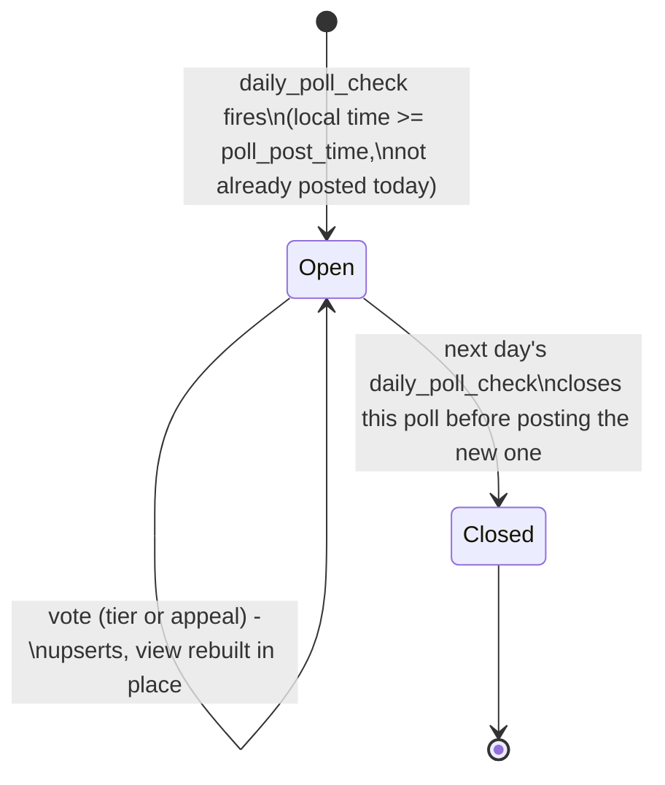

# oshinokobot — Architecture

## What this is

A Discord bot for a single guild whose main job is a daily character poll:
every day it posts a character (name + image), and members vote on two
independent questions — which archetype/audience tag the character would
most appeal to, and an S/A/B/C/D tier rating. An admin website manages the
character pool, tags, posting schedule, and results. It's designed as a
loose collection of misc/fun bot functionality; the poll is the first (and
currently only) feature, built inside a cog structure that leaves room for
more.

Full requirements/decisions live in [`PLAN.md`](PLAN.md); this file is the
as-built record of how those decisions turned into code, plus the reasoning
behind anything not obvious from reading the source.

## Single combined process

[watcher.staery.com/spec](https://watcher.staery.com/spec) is one `run.sh`,
one `$PORT`, one process per app. Rather than run the bot and the admin site
as two separate watcher deployments, this is **one process**:

- FastAPI/uvicorn is the thing bound to `127.0.0.1:$PORT` — it owns the
  admin UI and the health check.
- `discord.py`'s gateway client (`OshinokoBot`) runs alongside it as a
  background `asyncio.create_task`, started from FastAPI's `lifespan` and
  sharing the same `aiosqlite` connection and event loop.

`DISCORD_BOT_TOKEN` is optional at the config level — the admin site is
useful on its own (managing characters/tags ahead of time, reviewing past
poll results), so it shouldn't be impossible to start without one. When
it's unset, `lifespan` skips creating `OshinokoBot` entirely and logs that
it's running admin-only; nothing else changes.

The tradeoff, made deliberately: `/healthz` only reflects "is the HTTP
server up," not "is Discord connected." If the bot fails to log in (bad
token, revoked app, etc.), that's logged loudly to stdout — which watcher
captures — but the admin UI keeps running, since fixing a bad token needs a
host-level `.env` edit and restart regardless of whether the health check
is red or green. This is different from scheduler-bot's coupling (there,
the health server only starts after a successful gateway connection,
because `discord.py` doesn't itself listen on any port); with FastAPI as
the primary process here, decoupling the two seemed better than blocking
the whole admin site on Discord connectivity for a bot whose main value —
letting an admin manage characters — doesn't depend on Discord being up at
that moment.

- **Gateway reconnect resilience**: another real bug that shipped —
  `discord.py`'s own `Client.connect()` retries forever on ordinary network
  blips, but only for a specific set of exception types (`OSError`,
  `ConnectionClosed`, `aiohttp.ClientError`, etc.). Production hit a
  `RuntimeError` from uvloop ("File descriptor N is used by transport ...")
  during a reconnect attempt, which isn't one of those types, so it
  propagated straight out of `bot.start()`. The original `_run_bot` just
  logged and returned on any exception, which meant the task ended and the
  gateway connection was dead *permanently* — silently, since REST-only
  paths (the admin "trigger poll now" button, which reaches Discord via the
  bot's HTTP client and a channel object cached from before the crash) kept
  working fine, while voting buttons and `/force-poll` (both delivered over
  the gateway) quietly stopped responding until the whole process was
  restarted. `_run_bot` now wraps `bot.start()` in an outer retry loop with
  exponential backoff (15s up to a 5-minute cap): any exception other than
  `LoginFailure`/`PrivilegedIntentsRequired` (genuine misconfiguration, not
  transient — retrying can't fix a bad token) closes the dead bot instance
  and starts a fresh one, since a `discord.py` `Client` can't be restarted
  after `start()` exits. `app.state.bot`, which admin routes read to reach
  "the current bot," is republished on every attempt.

## Poll lifecycle


```mermaid
stateDiagram-v2
    [*] --> Open: daily_poll_check fires\n(local time >= poll_post_time,\nnot already posted today)
    Open --> Open: vote (tier or appeal) -\nupserts, view rebuilt in place
    Open --> Closed: next day's daily_poll_check\ncloses this poll before posting the new one
    Closed --> [*]
```

- **Trigger**: a `discord.ext.tasks` loop ticks every minute
  (`app/bot/cogs/polls.py::daily_poll_check`). It compares the current local
  time (in the admin-configured `poll_timezone`) against `poll_post_time`,
  and compares the *date* of the most recently posted poll (also converted
  to that timezone) against today. Idempotency comes from that DB
  comparison, not an in-memory flag — a restart landing inside the same
  eligible minute won't double-post, unlike a naive "have I already checked
  this minute" flag would need to survive a restart to keep working.
- **Scheduler resilience**: `discord.py`'s `tasks.loop` silently stops for
  good the moment its body raises anything other than a recognized
  reconnect-able network error — a real bug that shipped, not theoretical:
  one transient failure (a locked db, a rate limit on `channel.send`, a
  bad `poll_timezone` string) would permanently end daily posting with
  nothing louder than a single buried traceback, and nobody would notice
  short of watching stdout at the exact moment. `daily_poll_check`'s body
  is now wrapped in a try/except that logs and lets the next minute's tick
  retry instead of propagating, plus a `.error` handler as a backstop that
  restarts the loop if it ever stops anyway. A failed `channel.send`
  inside `_advance_daily_poll` no longer leaves a message-less poll open
  forever with its character burned from the pool for nothing — the poll
  row is deleted so the character falls back into the unused pool.
- **Character selection**: uniformly random from characters with no row in
  `polls` yet (`db.pick_random_unused_character`), except deprioritized
  characters sort last — see *Character priority* below. Once a character
  is posted, it's permanently "used," even if the poll technically failed
  (e.g. wrong channel) — there's no re-queue mechanism in v1 (see Open
  items). Optionally narrowed further by `guild_config.active_series` —
  see *Game filter* below — but "used" status itself is tracked globally,
  independent of that filter: narrowing to one game and back to all games
  never un-uses a character that already got its poll.
- **Closing**: happens as the *first step* of advancing to the next poll,
  not on a separate 24-hour timer. The previous message gets edited in
  place — final results added as embed fields, the view rebuilt with every
  component disabled — rather than deleted or replaced. Results are
  grouped by category, listing who picked it (`**A**: Bob, Jim`), not
  just a per-category count — same for both questions (`_format_tier_
  results`/`_format_appeal_results` in `app/bot/cogs/polls.py`), sourced
  from the same per-voter rows the admin UI's "Votes by user" table uses.
  Tiers with zero votes still get their own line (`**B**: —`) so the
  block stays a consistent 5-line shape; appeal tags with zero votes are
  omitted rather than filling the field with empty rows, since there can
  be up to 20 of them. A line with more than 10 names truncates to
  `..., +N more` — a safety margin against Discord's 1024-character
  embed-field limit on a very active poll, not something expected to
  matter at this bot's normal scale.
- **Result tier and core**: closing also computes `polls.result_tier`
  (the result tier) and `polls.result_tag_id` (the "core") —
  `_compute_result_tier`/`_compute_result_tag` in `app/bot/cogs/polls.py`,
  both thin wrappers around one shared `pick_majority` (`app/majority.py`
  — majority vote, zero votes on that question means no result at all
  rather than a default one, a tie among the top entries broken with
  `random.choice` among *only* the tied ones). Same rule, applied to each
  question separately — the result tier is whichever tier got the most
  votes, the core is whichever appeal tag did. Shown as "Result
  tier"/"Core" embed fields alongside the results above, and in the admin
  UI and public results page (see *Public results page* below).
- **Voting**: both questions are independent button groups on the same
  message (`app/bot/views.py::PollView`) — one `discord.ui.Button` per
  archetype tag, plus five more for the tier. The two questions behave
  differently: tier voting is an upsert (`PRIMARY KEY (poll_id, user_id)`
  on `tier_votes`) — re-picking changes your rating, it doesn't stack.
  Appeal voting is **multi-select** — each tag button toggles that one
  pick on/off independently (`db.toggle_appeal_vote`, `PRIMARY KEY
  (poll_id, user_id, tag_id)` on `appeal_votes`), so a voter can mark a
  character as appealing to more than one audience instead of being
  forced to choose exactly one. Every click rebuilds and re-renders the
  whole view via `edit_message`, so button labels carry live counts — the
  visible state change *is* the confirmation, no separate ephemeral "you
  voted for X" reply (same reasoning scheduler-bot used for its day/hour
  buttons).
- **Layout**: tag buttons fill rows 0-3 (5 per row), tier buttons always
  sit alone on row 4. That full empty row of gap is what makes "these are
  two different questions" visually obvious, backed up by two embed
  fields above the image — "Who would this appeal to?" and "What tier
  would you rate this character?" — that actually name the two questions.
  This started as a `discord.ui.Select` dropdown for the tag question;
  switched to one button per tag specifically so the two groups could be
  told apart at a glance, which a single dropdown row didn't give. A
  message caps out at 25 components total, and the tier row always claims
  5 of them, so tag buttons cap at **20** (was 25 as a dropdown) — past
  that, the poll only offers the first 20 (see *Open items*).
- **Restart safety**: `Polls.cog_load` re-registers a `PollView` for
  whatever poll is currently `open`, with current counts, so a bot restart
  mid-poll doesn't orphan the buttons on the still-live message.

## Game filter

`guild_config.active_series` (Config → "Which games to pull characters
from" on the admin site) restricts the daily pool to specific games/shows
— reusing `characters.series` rather than adding a separate column, since
that's already exactly "which game/show this character is from" (the
bulk-import format already populates it that way).

- **Default is unrestricted** (`active_series` `NULL`): every character is
  eligible regardless of `series`, including ones with no `series` set at
  all. This is also the state new games stay in automatically — nothing
  needs updating when a fresh series shows up, as long as nobody's ever
  narrowed the filter.
- **Restricting it is an explicit allowlist**: picking "Only selected
  games" and checking specific series stores that exact list
  (JSON-encoded in the `active_series` column). A `series` value not on
  that list — including one added *after* the list was saved — is
  ineligible until the admin comes back and adds it. This is deliberately
  not "auto-include new games unless excluded"; an admin who narrowed the
  pool on purpose shouldn't have it silently widen itself back out.
- **The "already used" rule still applies inside the filter**: a
  character that already got its poll never comes back, whether or not a
  filter is active — narrowing to one game just narrows which *unused*
  characters are eligible each time, it doesn't touch the used/unused
  status itself (see *Character selection* above). So restricting to one
  game means working through that game's characters exactly once each,
  same guarantee as the unrestricted pool.
- **Exhausting the filtered pool behaves like exhausting the whole pool
  today**: logs a warning and skips that day's poll (naming which game(s)
  are active, so it's obvious from the logs why), rather than recycling
  already-used characters from that game or silently falling back to
  other games. No auto-recycling exists yet regardless of filter state
  (see *Open items*).
- Saving "Only selected" with nothing actually checked is rejected with a
  validation error rather than silently behaving like "no games" (which
  would just mean every future poll skips) — has to be a deliberate choice
  through "All games" instead.

## Character priority

`characters.deprioritized` (0/1, default 0) lets an admin mark a character
"pick this last" without removing it from rotation. It only changes the
*order* `pick_random_unused_character` draws in, via
`ORDER BY deprioritized ASC, RANDOM() LIMIT 1`: since `deprioritized` is the
dominant sort key, every non-deprioritized character sorts ahead of every
deprioritized one regardless of their `RANDOM()` keys, and `RANDOM()` only
ever breaks ties *within* each group. The practical effect: as long as at
least one non-deprioritized character remains unused, a deprioritized one
is never picked — it only comes up once everyone else in the pool (or in
the active game filter, if narrowed) has already had a poll. Interacts
with the game filter exactly like the "used" flag does: it's a per-
character attribute independent of which games are currently active,
so narrowing/widening the filter doesn't touch it either.

Toggled from the admin site (`db.toggle_character_deprioritized`) — a
button next to each character on both the main character list and the
eligible-pool subtab below — rather than being settable at creation/import
time; there's no bulk-set path yet (see Open items).

### Eligible pool subtab

`GET /admin/characters/pool` shows exactly what
`pick_random_unused_character` can currently draw from — the same
`db.list_characters(unused_only=True, active_series=...)` call, so it's a
live view rather than an approximation of the real pool. Separate from the
main "All" character list (which shows every character regardless of used
status or the game filter) via a small subtab nav shared by both pages
(`_character_subtabs.html`); deprioritized characters still show up here
(they're still eligible, just lower priority) with a badge and a toggle to
undo it.

## Slash commands

`OshinokoBot.setup_hook` syncs the command tree (`self.tree.sync()`,
global — up to Discord's usual ~1hr propagation delay — plus an instant
copy to every guild in `Config.guild_ids` via `copy_global_to`).
`guild_ids` existed before any slash command did; these are what actually
consume it.

- **`/results`** (`Polls.results`) — posts the server's **cumulative**
  tier list: every closed poll's character, grouped by its result tier,
  across the server's whole history (`db.list_polled_characters` +
  `_format_cumulative_tier_list`) — not just the most recently finished
  poll. That was the first implementation and it was wrong: the point of
  the daily poll is building up a running tier list over time, and a
  single-poll recap doesn't show that. A closed poll with zero tier votes
  (no result) gets its own trailing "No result" line rather than being
  silently dropped from the list. Open polls are excluded — only
  `status = 'closed'` counts. Not restricted to a specific channel or
  role.
- **`/force-poll`** (`Polls.force_poll`) — closes whatever poll is
  currently open and posts a new one immediately, bypassing
  `poll_post_time`. A thin wrapper around the same `post_new_poll()` the
  admin UI's "Post a new poll now" button calls (one code path for
  "manually trigger a poll," reachable from either place), deferred +
  ephemeral since closing/posting can take longer than Discord's 3-second
  initial-response window. Gated with
  `@app_commands.default_permissions(manage_guild=True)` — unlike
  `/results`, this is disruptive (cuts the current poll's voting window
  short), so it defaults to members with Manage Server permission rather
  than anyone; a guild's own admins can loosen or tighten that further via
  Discord's Integrations settings.

## Data model

```
schema_migrations   name, applied_at

users                                  -- admin accounts, CLI-created only
  id, username (unique), password_hash, created_at

sessions                                -- admin login sessions (see Auth below)
  id (opaque token, PK), user_id -> users.id, created_at, expires_at

characters
  id, name, series (nullable), image_path, source_url (nullable),
  uploaded_by -> users.id (nullable), created_at

archetype_tags
  id, name (unique), created_at

guild_config                            -- singleton row (id = 1)
  channel_id (nullable until set), poll_post_time, poll_timezone,
  active_series (nullable — JSON array; NULL means all games, see
  Game filter below)

polls
  id, character_id -> characters.id, channel_id, message_id (nullable
  until sent), status (open|closed), posted_at, closed_at (nullable),
  result_tier (nullable — the result tier, see Poll lifecycle below),
  result_tag_id -> archetype_tags.id (nullable — the "core", same
  majority-vote rule as result_tier, for the other question)

appeal_votes
  poll_id -> polls.id, user_id, tag_id -> archetype_tags.id,
  display_name (nullable — snapshot at vote time, see below)
  PK (poll_id, user_id, tag_id)         -- multi-select: several tags per
                                            user, each toggled on/off
                                            independently (migration
                                            0007_appeal_votes_multi.sql)

tier_votes
  poll_id -> polls.id, user_id, tier (S|A|B|C|D),
  display_name (nullable — snapshot at vote time, see below)
  PK (poll_id, user_id)                 -- one tier per user, overwritable
```

`display_name` on both vote tables is a snapshot of `interaction.user.display_name`
taken at vote time (migration `0003_vote_display_names.sql`, nullable since
rows from before that migration have none). Storing it beats resolving
`user_id` back through Discord's API on every admin-page render: it works
in admin-only mode (no bot connection), survives a voter leaving the
server, and doesn't cost an API call per view. Re-voting refreshes the
stored name on `tier_votes` (`ON CONFLICT ... DO UPDATE`); on
`appeal_votes` it's captured whenever a tag is newly toggled on (a nickname
change shows up the next time that person picks a *new* tag, not
necessarily on every click, since toggling an existing pick back off just
deletes the row) — it's a snapshot either way, not a live-synced value.
Both the admin poll-detail page (`/admin/polls/<id>`) and the public
per-character page (`/results/<id>`) merge both vote tables by `user_id`
into one per-voter table (`app/admin/poll_results.py::build_voter_rows`,
shared by both routes) — a voter who only answered one question still
gets a row, with a `—` for the one they skipped. The public version omits
the numeric Discord id that the admin one shows next to the name; there's
no reason to expose raw snowflakes on a page anyone can load.

`characters` with no matching row in `polls` = the unused pool. Deleting an
`archetype_tag` that already has `appeal_votes` against it is blocked by
the FK (caught in the route, surfaced as a friendly error) rather than
cascaded — retiring a tag means not using it going forward, not rewriting
a past poll's results.

Only one `guild` is supported — its identity is `DISCORD_GUILD_ID` in the
environment, not a database row, since this bot only ever lives in one
server (see PLAN.md). `guild_config` only holds the parts an admin should
be able to change without a redeploy: which channel, and when.

## Public results page

`/results` and `/results/<poll_id>` (`app/admin/routes/public_results.py`)
are the one deliberately unauthenticated part of the web app — no
`require_admin` dependency anywhere in that router, mounted without an
`/admin` prefix. Read-only; nothing in that file can mutate state. A link
to it ("Public results ↗") sits in the admin nav for convenience.

`/results` takes an optional `?series=<game>` query param — a dropdown
above the three sections narrows all of them to one game/show at a time,
sourced from whichever `characters.series` values actually have a closed
poll (not every series ever uploaded, so there's never an option that
lands on an empty page). Plain GET query param, not a stored preference,
so a filtered view is a shareable/bookmarkable URL like the rest of the
page; the `<select>` auto-submits via `onchange` with a plain submit
button as the no-JS fallback. Distinct from `guild_config.active_series`
(the admin-configured pool the *daily poll itself* draws from, see *Game
filter* below) — this only changes what's displayed here.

Three sections, all on `/results` except the third:

- **"Tier List"** — every character's *average* score across all its
  individual tier votes (S=5 down to D=1,
  `app/admin/poll_results.py::TIER_VALUES`), bucketed into its
  `nearest_tier` and rendered as an actual S/A/B/C/D grid (`.tier-grid` in
  `admin.css`) — a colored tier row holding image chips for every
  character that landed there, not a flat ranked table. All five rows
  always render, even empty ones ("No characters yet"), same
  consistent-shape convention as the bot's own `_format_tier_results`.
  Within a row, characters are still ordered by the same average-score
  sort. The average itself is deliberately a different metric from
  `polls.result_tier` (the per-poll majority winner, i.e. the mode) —
  averaging captures spread that a pure majority vote throws away (a
  character with mixed S/A/B votes and one with unanimous A votes can
  both land on A as their result tier, but their averages tell different
  stories). Characters with zero tier votes have no average and are left
  out of the grid entirely, rather than shown with an undefined score.
  The row colors are a single-hue **ordinal** ramp (light→dark, S most
  prominent down to D least), not a categorical palette — S/A/B/C/D is an
  ordered ranking, not independent identities, so one hue carries the
  order instead of five unrelated hues.
- **"Types of Characters"** — grouped by `polls.result_tag_id` (the
  character's "core": whichever appeal tag won the most votes, computed
  with the exact same majority+random-tiebreak rule as the result tier —
  see *Poll lifecycle*). Characters with zero appeal votes land in a
  trailing "No core yet" group instead of being dropped.
- **"Individual Poll Results"** — a flat table of every closed poll,
  most-recently-closed first, reusing the same `db.list_polled_characters`
  rows as the "Types of Characters" section above (just reversed) rather
  than a separate query.
- **Per-character detail** (`/results/<poll_id>`, linked from every
  character name above) — the same tier/appeal breakdown and per-voter
  table the admin poll-detail page shows. Only closed polls are published
  here (`404` for an open or nonexistent poll id) — an open poll's outcome
  isn't decided yet, and it's already visible live on Discord for anyone
  in the server.
- **Character images are served publicly** via `GET /media/<filename>` —
  a second route distinct from the auth-gated `GET /admin/media/<filename>`,
  both sharing the same path-safety check
  (`app/admin/images.py::resolve_media_path`, factored out specifically so
  that check has one implementation, not two to keep in sync).
- Deliberately no explanatory copy on the page itself beyond the section
  headers and table/column labels — the first version had a paragraph
  under each heading spelling out the methodology (average vs. majority,
  the tie-break rule, etc.); removed on request in favor of the page just
  showing the data.

## Poll deletion

`db.delete_poll` removes a poll's `appeal_votes` and `tier_votes` rows
before the `polls` row itself (required — `PRAGMA foreign_keys = ON`
means the poll row can't go first while votes still reference it).
Because "used" status is derived purely from *whether a `polls` row
exists* for a character (see `pick_random_unused_character`), deleting a
poll is a full undo: the character falls right back into the unused pool,
not just out of the visible history. Reachable from the admin polls list
(`DELETE /admin/polls/<id>`, htmx, returns the updated list) and from the
poll detail page itself (`POST /admin/polls/<id>/delete`, a plain form
since the page being deleted can't very well swap itself in place —
redirects to the list instead). Both require confirmation, and the
confirmation text says explicitly if the poll being deleted is still
`open` — nothing here touches the live Discord message, which is left
orphaned but harmless (every vote callback already treats a poll that
`db.get_poll` can't find as "not open anymore").

## Full data export

`GET /admin/export` (`app/admin/routes/export.py`, linked from the nav bar
as "Export data ⬇") builds a `.zip` in memory and returns it as a download:

- `data/*.json` — one file per table in `db.EXPORT_TABLES` (`characters`,
  `archetype_tags`, `guild_config`, `polls`, `tier_votes`, `appeal_votes`),
  each a verbatim `SELECT *` dump via `db.dump_table`. `users` and
  `sessions` are deliberately never included — they're admin-login
  internals (password hashes, session tokens), not "the bot's data."
- `manifest.json` — generation timestamp, a row count per table, and a note
  on how the files relate (ids are plain foreign keys across the JSON
  files, same as in the DB; `characters[].image_path`'s basename names a
  file under `images/`).
- `images/` — every file a `characters` row's `image_path` points to, read
  straight off `MEDIA_DIR` through the same `resolve_media_path` the media
  routes use, de-duped by filename. A row whose file has gone missing since
  upload is skipped rather than failing the whole export.

Built fully in memory (`io.BytesIO` + `zipfile`) rather than streamed —
fine at this bot's scale (one guild's characters/polls/images); revisit
with a temp file if the media library ever grows large enough to matter.
Gated by the same `require_admin` dependency as the rest of `/admin/*`
(the export includes per-voter Discord user ids, which isn't public data).

## Bulk character import

`POST /admin/characters/import` (`app/admin/routes/characters.py`) accepts
either an uploaded `.json` file or pasted text — a top-level object with a
`characters` array, each entry needing `name` and `image_base64` (raw
base64, `image_mime` explicit rather than sniffed from bytes, default
`image/png`). Built specifically so a Claude session doing wiki/fandom
scraping can hand the admin one file instead of uploading characters one
at a time.

The whole batch is processed in a single pass rather than an all-or-nothing
transaction: each entry is independently classified as `imported`,
`skipped` (case-insensitive `(name, series)` match against an existing
character — not an error), or `error` (missing required field, invalid
base64, unsupported mime), and one bad row never blocks the rest of the
batch. The response is an htmx partial — a results table for the import
form's target, plus an out-of-band swap of the character list so both
update from one request.

## Runtime & deployment

### Spec conformance

| watcher requirement | How this satisfies it |
|---|---|
| `run.sh` at repo root, foreground | venv → `pip install` → source `.env` → run migrations → `exec`s `python -m app`, so watcher tracks the uvicorn process's PID directly |
| No root, pip-only deps | Pure Python: `fastapi`, `uvicorn[standard]`, `jinja2`, `python-multipart`, `aiosqlite`, `discord.py`, `tzdata` |
| Bind `127.0.0.1:$PORT` | `uvicorn.run(app, host=config.host, port=config.port, ...)` in `app/__main__.py` |
| Health check | `GET /healthz`, unauthenticated, separate from `/admin/*` so watcher's poller never gets bounced through a login redirect |
| stdout/stderr logging only | `logging.basicConfig`-equivalent stdout handler stays primary (`app/logging_setup.py`), mirrored to a capped rotating file for local inspection |
| Non-zero exit = crashed | Uncaught exceptions during startup exit non-zero before uvicorn ever binds |

### Persistence

SQLite via `aiosqlite`, one file at `OSHINOKO_DB_PATH` (default
`oshinoko.db`) in the persistent working directory — survives restarts and
redeploys, gitignored (runtime state, not source). Same treatment for
`MEDIA_DIR` (default `media/`), where uploaded character images live.

### Migrations

`migrations/NNNN_description.sql` — plain numbered SQL files, tracked in a
`schema_migrations` table so `python -m app.migrate` is idempotent and
safe to run on every deploy. `run.sh` runs it as its own step before
`exec`-ing the app; the app's own startup never creates or alters tables.

`run_migrations` also runs `_backfill_poll_results` after applying any
pending `.sql` files — not a schema change, a **data** one: `result_tier`
and `result_tag_id` are computed once, at the moment a poll closes, so any
poll that closed before those columns (or that computation) existed has
them `NULL` forever even though its votes are still sitting untouched in
`tier_votes`/`appeal_votes`. That's a real bug that shipped, not a
theoretical one — the public results page trusts the stored column, so
those characters looked like they had no result at all. The backfill
recomputes both fields for any closed poll where either is still `NULL`,
using the same `pick_majority` (`app/majority.py`) the live code uses,
and only writes the field that's actually missing (`COALESCE`) so a poll
with one field already set never gets that one silently reassigned to a
different random tie-break winner on a later run. Safe to run every
deploy, same as the SQL migrations themselves.

### Secrets

`DISCORD_BOT_TOKEN` (optional — see *Single combined process* above) and
`DISCORD_GUILD_ID` (optional, comma-separated if more than one — same
convention as scheduler-bot's `guild_ids`) are read from `.env`, sourced by
`run.sh` before migrations run. `.env` is gitignored and never touched by
git — placed on the host once, out of band, the same way the SQLite file
and media directory already live outside what git manages.

`DISCORD_GUILD_ID` parses into `Config.guild_ids: list[int]` but isn't
consumed anywhere yet — this bot has no slash commands, so there's nothing
to guild-scope-sync. It's kept as a list (rather than a single id) purely
so that shape doesn't need revisiting if a future command needs instant
per-guild sync instead of waiting on Discord's global-sync propagation
delay.

### Auth

A real login page (`GET/POST /admin/login`) with server-side sessions,
not HTTP Basic Auth (the original v1 choice — see PLAN.md — turned out to
be worth replacing with something that looks and behaves like an actual
app login rather than a browser-native credential prompt).

- **Sessions live in SQLite**, not a signed cookie: `sessions(id, user_id,
  created_at, expires_at)` (migration `0002_sessions.sql`). The cookie
  (`oshinoko_session`) only carries the opaque `id` — `secrets.token_urlsafe(32)`,
  cryptographically random, unguessable — with everything else looked up
  server-side. This avoids needing a signing `SECRET_KEY` (another secret
  to provision and rotate) and makes logout a plain `DELETE`, no
  denylist required. TTL is a fixed 7 days from creation (no sliding
  renewal in v1); expired sessions are swept opportunistically on every
  login rather than via a background task, since traffic here is low
  enough that lazy cleanup is enough.
- The cookie is `HttpOnly` + `SameSite=Lax`, not marked `Secure` — the app
  itself only ever speaks plain HTTP on `127.0.0.1` (see *Runtime &
  deployment*); if it's ever exposed through a TLS-terminating reverse
  proxy, that's worth revisiting.
- `require_admin` (`app/admin/auth.py`) is now a plain dependency that
  raises `NotAuthenticated` rather than an `HTTPException` — an
  app-level `@app.exception_handler(NotAuthenticated)` in `server.py`
  turns that into a `303` redirect to `/admin/login?next=<original path>`,
  so hitting any protected route while logged out lands on the login form
  and returns you to where you were headed after a successful login.
  `next` is validated to be a same-site path (`/foo`, not `//evil.example`
  or an absolute URL) before it's ever redirected to, both when bouncing
  to the login page and when honoring it after a successful submit — an
  open-redirect guard against a crafted login link.
- Passwords are still hashed with stdlib `hashlib.pbkdf2_hmac` rather than
  bcrypt/argon2 — those need a C extension, and watcher's guaranteed
  toolset doesn't promise a compiler. A lookup miss during login still
  runs a full PBKDF2 verification against a dummy hash, so "no such user"
  and "wrong password" take comparable time — no timing-based username
  enumeration. Accounts are still created only via `python -m
  cli.create_user`, which always prompts interactively (`getpass`) and
  never accepts a password as a CLI argument — unchanged by this switch.

## Open items (v1 limits, not blocking)

- **Empty character pool**: if the daily check fires and every character
  has already been posted, it logs a warning and skips — no recycling of
  old characters, no admin-facing alert yet.
- **>20 archetype tags**: a poll can only show `MAX_TAG_BUTTONS` (20) at a
  time — `PollView` truncates rather than paginating.
- **Multi-guild**: explicitly out of scope for now (see PLAN.md);
  `guild_config` would become a table instead of a singleton row if that
  changes.
